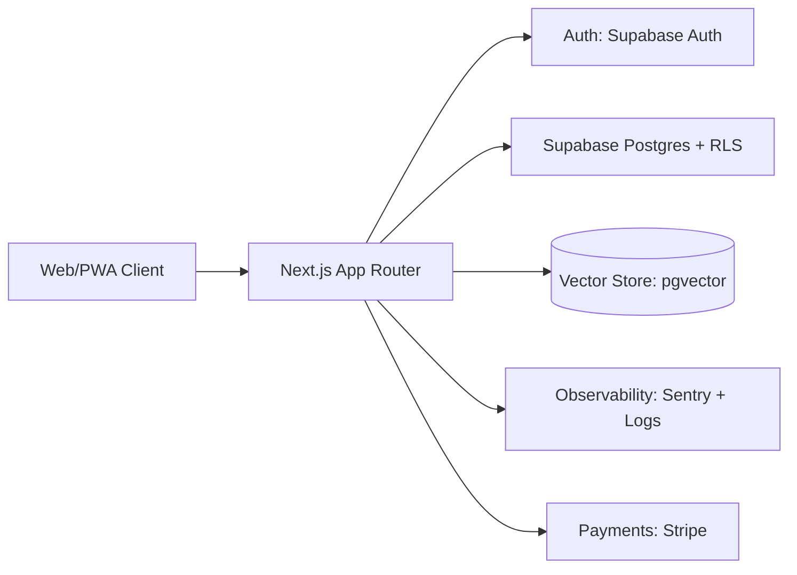

# Enterprise Architecture Blueprint — Vovinam App

Tai lieu nay chuyen ban full A->Z blueprint thanh cau truc ky thuat co the trien khai ngay.

## 1) Product Vision va Operating Model

- App van hanh nhu mot coach ca nhan: moi lan vao app, nguoi dung thay 1 buoc tiep theo ro rang.
- UX rule bat buoc:
- Khong lo thong tin ky thuat cho user.
- Moi man hinh co CTA chinh duy nhat.
- Giam so lua chon, tang kha nang hoan thanh hanh dong.
- Product metric uu tien:
- Activation D1 (hoan thanh bai hoc dau tien).
- Weekly training completion.
- Retention W4.
- Upgrade conversion (free -> premium).

## 2) Domain Architecture

He thong tach theo 8 domain, moi domain co API contract rieng:

- Identity & Access
- Curriculum & Progression
- Training Plan & Schedule
- AI Coach & RAG
- Community
- Commerce (store + subscription)
- Analytics & Experimentation
- Admin Operations

Quy tac domain:

- Frontend chi goi API route theo domain.
- Business rules nam tai server (Route Handler/Server Action), khong dat tren client.
- Database enforce them bang RLS de chong bypass.

## 3) Runtime Architecture (Production)

### Request flow chuan

1. Client gui request den Next.js.
2. Server xac thuc session tu Supabase.
3. Server validate payload (schema).
4. Server thuc thi policy business.
5. Database enforce RLS lan cuoi.
6. Server tra response theo ngon ngu UX, khong lo stack trace/noi bo.

## 4) Data Model Strategy

- Su dung Postgres lam source of truth.
- Progress va curriculum la du lieu mang tinh quan he, uu tien chuan hoa.
- AI memory va retrieval tach ro:
- ai_knowledge_chunks cho ingestion va semantic search.
- ai_chat_sessions, ai_chat_messages cho hoi thoai.

Mo rong schema duoc define trong file:

- [supabase/enterprise_blueprint.sql](supabase/enterprise_blueprint.sql)

## 5) Security Model

### Auth

- End-user: Supabase Auth (email/password, OAuth, passkey theo phase).
- Admin/Coach: bat buoc MFA.

### Authorization

- Role model: user, coach, admin.
- Quy tac permission:
- user chi thao tac du lieu cua minh.
- coach thao tac hoc vien duoc phan cong.
- admin full scope.

### Defense in depth

- API guard tai Next.js (auth + schema + rate limit).
- RLS tai DB la "final gate".
- Audit log cho thao tac nhay cam.

Tai lieu security chi tiet da co san:

- [docs/security-blueprint.md](docs/security-blueprint.md)

## 6) AI Coach System Design

### Orchestration pipeline

1. Nhan user intent (lesson help, injury-safe training, plan adjustment...).
2. Retrieve context:

- User state (belt, progress, recent sessions).
- Curriculum metadata.
- Top-K RAG chunks tu vector search.

3. Compose answer theo policy:

- clear next step
- safe instruction
- no over-claim

4. Luu memory vao ai_chat_messages + feedback loop.

### Safety rails

- Prompt hardening theo role va do tuoi (neu co).
- Refusal/deflection voi yeu cau nguy hiem.
- Khong cho model thao tac truc tiep DB.

## 7) Performance & Reliability Targets

- P95 API latency core flows < 400ms.
- LCP mobile < 2.5s cho trang chinh.
- Error rate < 1% request/day.
- Uptime muc tieu: 99.9%.

Ky thuat:

- ISR/cache cho public content.
- Dynamic rendering cho profile/progress.
- Background jobs cho ingestion, analytics rollups.
- Graceful fallback cho community/AI neu backend cham.

## 8) API Contract Standards

- Versioning: /api/v1/... cho endpoint on dinh.
- Response envelope:
- success payload.
- error code + user_message (khong lo internal error).
- Idempotency key cho checkout va thao tac co nguy co retry.

## 9) Observability & Operations

- Structured logging (request_id, user_id, route, duration_ms).
- Tracing qua Next route handlers.
- Alerting:
- auth failures spike
- payment webhook errors
- AI timeout spike
- Dashboard KPI theo domain: activation, completion, retention, conversion.

## 10) Deployment Strategy

- Environments: dev -> staging -> production.
- Migration flow:

1. SQL migration len staging.
2. Smoke test API + RLS.
3. Blue/green hoac rolling deploy app.
4. Promote production.

- Rollback:
- App rollback bang previous build.
- DB rollback bang forward-fix migration (tranh down migration nguy hiem trong prod data).

## 11) Definition of Done (Enterprise)

Mot phase duoc xem la done khi dat du 4 nhom:

- Functional: dung logic business va UX flow.
- Security: pass authz/RLS test cases.
- Performance: dat SLA da cam ket.
- Operations: co log, alert, runbook.
