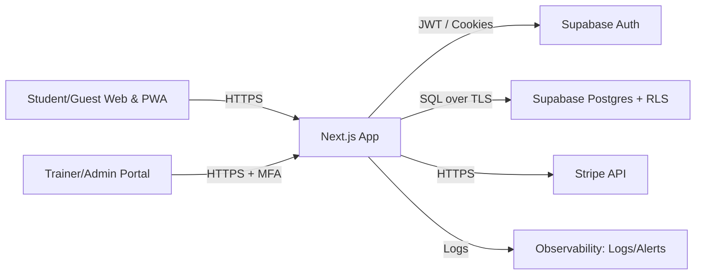

# Security Blueprint — Vovinam Learning (Next.js + Supabase)

Tài liệu này là “nền móng” để hệ thống **khó bị xâm nhập, dễ truy vết, và chịu tải tốt**.

> Ghi chú thực tế: Không ai có thể “đảm bảo 100% không bao giờ sập”, nhưng có thể thiết kế để **giảm xác suất**, **giảm tác động**, và **phục hồi nhanh**.

---

## 0) Phạm vi & giả định

- Frontend: Next.js (App Router) + PWA.
- Backend: Next.js Route Handlers / Server Actions.
- Identity/DB: Supabase Auth + Supabase Postgres + RLS.
- Dữ liệu nhạy cảm: PII (họ tên, SĐT), dữ liệu tiến độ/điểm danh/kỳ thi.
- Tích hợp ngoài: Stripe (thanh toán), CDN/hosting.

Mục tiêu:

- **Zero Trust** (không tin bất kỳ request/kết nối nào).
- **Least privilege** (quyền tối thiểu).
- **Defense in depth** (nhiều lớp).
- **Auditability** (truy vết).

---

## 1) Zero Trust Architecture

### 1.1 Sơ đồ luồng (high-level)

Trust boundaries:

- Client không tin cậy.
- Next.js server là lớp enforcement (authz, validation, rate limit).
- DB có RLS để “khóa chốt” (server bị lộ key vẫn hạn chế blast radius nếu đúng thiết kế).

### 1.2 AuthN (Xác thực) bằng Supabase Auth + MFA

**Tài khoản Trainer/Admin** phải bật MFA (TOTP) để giảm rủi ro lộ mật khẩu.

Khuyến nghị:

- Đăng nhập Supabase (email/password hoặc magic link).
- Bật **MFA TOTP** cho Trainer/Admin.
- Enforce MFA ở 2 lớp:
  1. **App/API layer**: mọi endpoint nhạy cảm yêu cầu “MFA-complete”.
  2. **DB layer (RLS)**: policy cho các bảng nhạy cảm check AAL/AMR trong JWT.

Gợi ý cách enforce:

- JWT của Supabase thường có claims liên quan MFA/AAL (ví dụ `aal`, `amr`).
- Ở tầng API: kiểm tra session đã đạt AAL2 trước khi cho thực hiện thao tác (chấm thi, sửa điểm danh, đổi đai).
- Ở tầng RLS: policy kiểu “chỉ allow nếu `auth.jwt()->>'aal' = 'aal2'`” (tuỳ phiên bản Supabase).

> Lưu ý: Claims cụ thể phụ thuộc Supabase version. Luôn kiểm tra payload JWT thực tế trên môi trường của bạn.

### 1.3 AuthZ (Uỷ quyền) và nguyên tắc

- **Không bao giờ** tin role gửi từ client.
- Role phải nằm trong:
  - Custom claim trong JWT (do server set), hoặc
  - Bảng `profiles`/`user_roles` trong DB, đọc bằng RLS.
- Mọi thao tác nhạy cảm phải có:
  - `auth.uid()` hợp lệ
  - role hợp lệ
  - phạm vi hợp lệ (trainer chỉ tác động học viên được phân công)

### 1.4 Quản lý secrets

- Không để service role key trong client.
- Dùng secret manager (Vercel/Render/Fly secrets) thay vì commit.
- Rotate key định kỳ.

---

## 2) Data Encryption

### 2.1 In Transit (khi truyền dữ liệu)

- Bắt buộc **HTTPS**.
- Bật **HSTS** cho production (`Strict-Transport-Security`).
- Cookies auth:
  - `HttpOnly: true`
  - `Secure: true` (prod)
  - `SameSite: Lax/Strict` tuỳ luồng

### 2.2 At Rest (khi dữ liệu nằm yên)

Supabase/Postgres thường được bảo vệ bởi encryption của hạ tầng lưu trữ. Với PII, nên có thêm lớp:

**Mô hình encrypt + hash cho SĐT** (vừa bảo mật, vừa tìm kiếm/unique):

- `phone_encrypted` (bytea/text) — mã hoá bằng key của bạn.
- `phone_hash` (text) — hash của số đã normalize (SHA-256 + salt/pepper) để:
  - enforce unique
  - lookup mà không lộ plaintext

Key management:

- Dùng KMS (AWS/GCP) nếu có.
- Rotate key: lưu `key_version` cùng record.

> Nếu không cần tìm kiếm theo SĐT: chỉ cần mã hoá (không cần hash).

---

## 3) API Security (Next.js)

### 3.1 Validation & input hardening

- Schema validate (Zod/valibot) cho mọi API.
- Giới hạn:
  - `Content-Length` (body size)
  - max độ dài string
  - max số item trong mảng
- Trả lỗi 400/413 rõ ràng.

### 3.2 SQL Injection

- Không xây SQL string thủ công.
- Dùng query builder/parameterized queries.
- Ưu tiên:
  - Supabase client (param-safe)
  - RPC functions cho logic phức tạp
- Bật RLS và policy đúng để giảm blast radius.

### 3.3 XSS

- React auto-escape: ok.
- Tránh `dangerouslySetInnerHTML`.
- Nếu cần render HTML: sanitize (DOMPurify) + CSP.

### 3.4 CSRF

- Nếu auth dựa trên cookies: cần CSRF defense:
  - `SameSite` + check `Origin`/`Referer` cho POST/PUT/DELETE
  - hoặc CSRF token (double submit)
- Nếu auth bằng `Authorization: Bearer <access_token>`: CSRF thấp hơn (vì browser không tự gửi token).

### 3.5 Rate limiting & abuse protection

- Rate limit theo IP và theo tài khoản (login, checkout, AI chat).
- Production: dùng Redis/Upstash.
- Dev/demo: in-memory best-effort.

### 3.6 Security headers

- `X-Content-Type-Options: nosniff`
- `X-Frame-Options: DENY`
- `Referrer-Policy: strict-origin-when-cross-origin`
- `Permissions-Policy` chặn camera/mic mặc định, chỉ mở route cần thiết
- CSP (tối thiểu) + lộ trình nâng dần (nonce/hashes) để không phá Next.js

---

## 4) RBAC + RLS (Supabase)

### 4.1 Vai trò

- Guest: chỉ xem nội dung public.
- Student: xem/sửa dữ liệu của mình; học nội dung theo đai.
- Trainer: quản lý học viên được phân công; điểm danh/chấm thi.
- Admin: full quyền.

### 4.2 Ma trận quyền (tóm tắt)

- Profiles
  - Student: R/U own (giới hạn field)
  - Trainer: R assigned
  - Admin: CRUD all

- Attendance/Exams
  - Student: R own
  - Trainer: CRUD assigned
  - Admin: CRUD all

- Audit logs
  - Student: none
  - Trainer: R (phạm vi liên quan)
  - Admin: R (full)

### 4.3 Mô hình bảng (gợi ý)

- `user_roles(user_id, role)` (User/Coach/Admin)
- `coach_students(coach_id, student_id)` (phân công lớp)
- `profiles(user_id, display_name, avatar_url, ...)` (thông tin user tự sửa)
- `student_progress(user_id, belt_rank, points, updated_by, ...)` (nhạy cảm: chỉ Coach/Admin)
- `attendance(student_id, session_date, present, recorded_by, ...)`
- `exam_attempts(student_id, belt_target, score, result, recorded_by, ...)`
- `tuition_payments(student_id, amount, paid_at, recorded_by, ...)` (Admin-only)

### 4.4 RLS policies (ví dụ)

File SQL hoàn chỉnh (tạo bảng + enable RLS + policy) đã được chuẩn hoá theo 3 role **user/coach/admin**:

- `supabase/rls.sql`

> Tip: Khi policy phức tạp, cân nhắc dùng function `security definer` để tối ưu query và tránh sai logic.

### 4.5 EQ / UX khi bị từ chối

Thay vì “403 Forbidden”, trả thông báo theo ngữ cảnh:

- Nội dung bị khoá theo đai: "Bạn cần đạt Lam đai để mở khóa kỹ thuật này."
- Tính năng quản trị: "Tính năng này dành cho Huấn luyện viên/Quản lý."
- Chưa đăng nhập: "Bạn cần đăng nhập để tiếp tục."

---

## 5) DevSecOps: Backup/DR + Rate limit + Audit logs

### 5.1 Backup & Disaster Recovery

Định nghĩa:

- RPO (mất dữ liệu tối đa): 24h (tối thiểu) → tốt hơn 1h.
- RTO (thời gian khôi phục): 2–4h (tối thiểu) → tốt hơn 30–60m.

Quy trình:

- Backup hằng ngày (pg_dump) + encrypt + upload S3/GCS (bucket riêng, quyền riêng).
- Retention: 30–90 ngày (tuỳ nhu cầu).
- Restore drill: mỗi tháng 1 lần (khôi phục lên staging).

### 5.2 Rate limiting (mẫu)

Production nên dùng Redis/Upstash. Demo/local có thể in-memory.

Nguyên tắc:

- Login: 10 req / 5 phút / IP
- Checkout: 20 req / 10 phút / IP
- AI chat: 60 req / 5 phút / IP

### 5.3 Audit logs

Mục tiêu: truy vết “ai đã đổi kết quả thi thăng đai của võ sinh Phúc”.

Thiết kế:

- Append-only (không update/delete với user thường).
- Log cả before/after cho thao tác update.
- Chỉ Admin (và Trainer liên quan) được xem.

Gợi ý triển khai:

- App layer: mọi API nhạy cảm sau khi ghi DB phải insert vào `audit_logs`.
- DB layer: trigger có thể log before/after, nhưng thiếu metadata (ip/user-agent) → bổ sung app layer.

---

## 6) Checklist P0/P1/P2

P0 (ngay):

- MFA bắt buộc cho Trainer/Admin.
- RLS chuẩn cho PII/progress/exams.
- Validation + body limit + rate limit cho endpoints nhạy cảm.
- Audit logs cho thay đổi thi/đai/điểm danh.

P1 (sớm):

- Backup daily + restore drill.
- Observability (Sentry/alerts).
- CSP nâng dần.

P2 (sau):

- WAF/CDN bot protection.
- Key rotation automation.
- Automated security tests (SAST/DAST).
